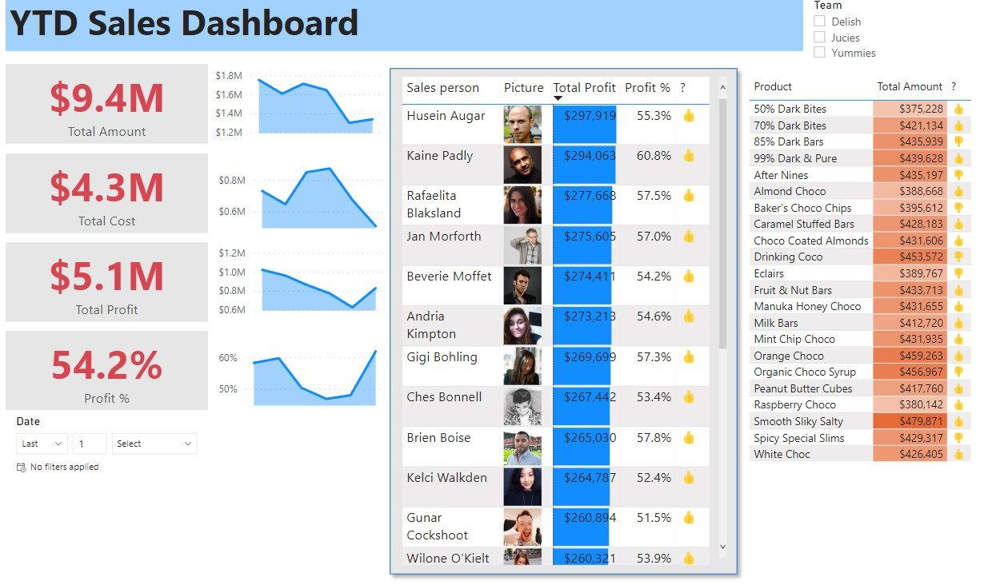
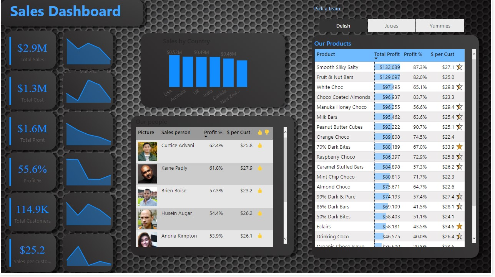

## Customized Background in PowerBi, using Canva
This project is to show how to use Canva and to produce a beautiful gray background to be applied on a power bi dashboard.
Project features:
 * Use of Canva to build the background, exporting the file.
 * Placing background on Dashboard.

Before:

After:

